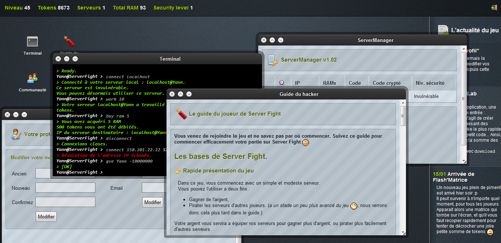

# Serverfight
### 2011 personal project

## Presentation

Serverfight is a web game that you can play in your browser. It's about maintaining your own server farm, hacking other people's servers and playing various minigame in a "Web OS"-like environment featuring a fake console with various commands.

Here is a video kindly made by MaitreChocobo
 to introduce the game https://www.youtube.com/watch?v=t9mTkb-BbLI (french)

**It's still live, try it out: http://sf.yann-p.fr/**

## Disclaimers
- **This is code written when I was in high school.** I did not know OOP, software or database principles. I am aware that untested, undocumented and unmaiainable. Also a reason it was not further developed.
- This is a ugly soup of PHP, MySQL, HTML, CSS and Javascript.
- The passwords aren't stored very safely (SHA1, private salt common to all accounts). Change it in `socle.php`

## Installation

* Setup linux crons (files in `cron/`), one that runs each hour and another one at midnight every day.
* Database setup: edit `socle.php` and apply `structure.sql` to your MySQL database.
* Insert a user named 'Admin' with id 1 and grade 3

## Features

* Homepage with a real-time peek of the activity of the game
* Web UI with hints, top bar with your in-game characteristics, desktop with icons corresponding to the applications listed below, window management (maximize/minimize/close/move etc.)
* Terminal with commands and history
    * connect to a server
    * add aliases to commands
    * buy resources for your servers
    * improve security of your servers
    * change password of a server
    * get random servers of your level
    * destroy a server
    * ping
    * trade work time for in-game money
    * hack and gain command of other players' servers.
* Mini-games
    * Flash-matrice: win in-game money by being the first to copy an animated string of characters
    * Decryptlab: multi-player real-time challenges with bets
* Servermanager, an gui to list and give info about your servers
* Fake browser
    * Create, edit, deletes sites in BBCode
    * Site ranking by links that point to it
* Ranking of players
* In-game guide
* Communication between players
    * Real time chat-room with private message functionality
    * In-game email app
* Change password/email address
* Extensive moderation tools (delete activity, block IP, etc.)
* Extensive administration tools (logs, connect as player, etc.)

## Tech used

- PHP 5
- Jquery + Jquery UI (for the webos) with intensive use of AJAX
- MySQL

## Licence 
GPLv3